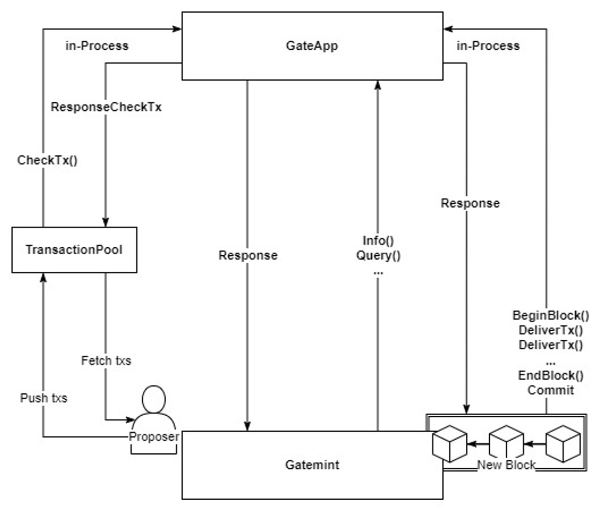

# 交易和区块架构

交易在 GateChain 中代表触发区块链状态变化的基本操作。理解交易和区块架构对于在 GateChain 上开发的开发者来说至关重要。

## 交易流程

### 1. 交易创建和传播
- 用户使用私钥创建和签名交易
- 已签名的交易被传播到 GateChain 网络
- 每个交易包含发送者、接收者、值和数据等基本信息

### 2. 交易池（Mempool）
- 未确认的交易存储在交易池中
- 验证者根据以下条件从交易池中选择交易：
  - Gas 价格优先级
  - 交易 nonce
  - 账户余额验证

### 3. 区块创建
- 验证者通过以下方式创建新区块：
  - 从交易池中选择交易
  - 验证交易签名
  - 执行交易操作
  - 更新状态

### 4. 区块验证和共识
- 新区块通过共识机制
- 其他验证者验证：
  - 区块哈希
  - 交易签名
  - 状态转换
  - 共识规则

### 5. 区块最终确定
- 一旦达成共识：
  - 区块被添加到链上
  - 状态被更新
  - 交易被标记为已确认

## 区块结构

### 区块头
- 前一个区块哈希
- 时间戳
- 区块高度
- 状态根
- 交易根
- 共识相关数据

### 区块体
- 交易列表
- 交易收据
- 执行结果

## 交易类型

1. **价值转移**
   - 标准代币转账
   - 原生代币（GT）转账

2. **智能合约操作**
   - 合约部署
   - 合约方法调用
   - 状态修改

3. **系统操作**
   - 验证者操作
   - 治理提案
   - 参数更新

## 交易生命周期

1. **创建**
   - 交易签名
   - 参数设置
   - Gas 估算

2. **验证**
   - 签名验证
   - 余额检查
   - Nonce 验证

3. **执行**
   - 状态变更
   - 事件发出
   - 结果记录

4. **最终确定**
   - 收据生成
   - 状态提交
   - 区块包含

