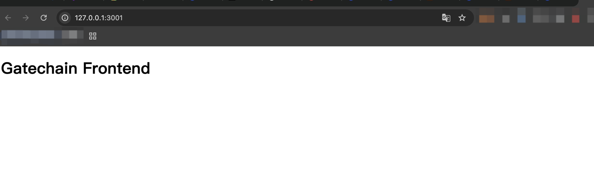
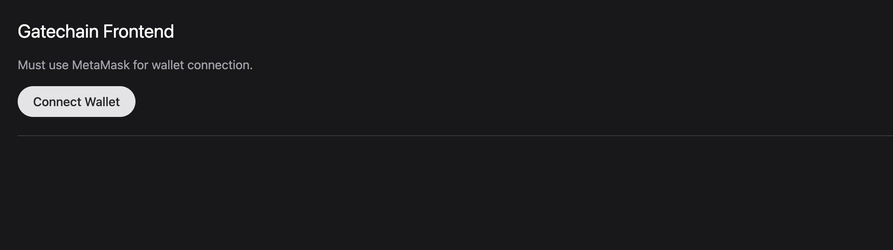
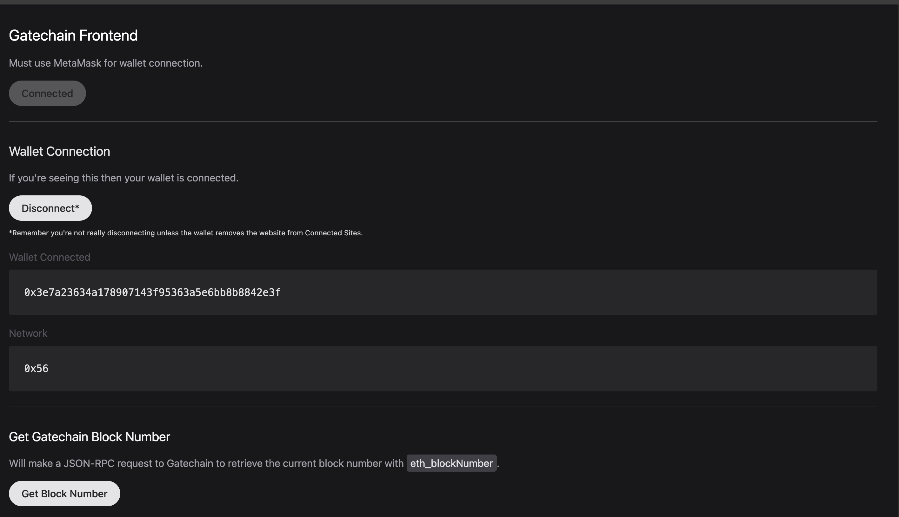
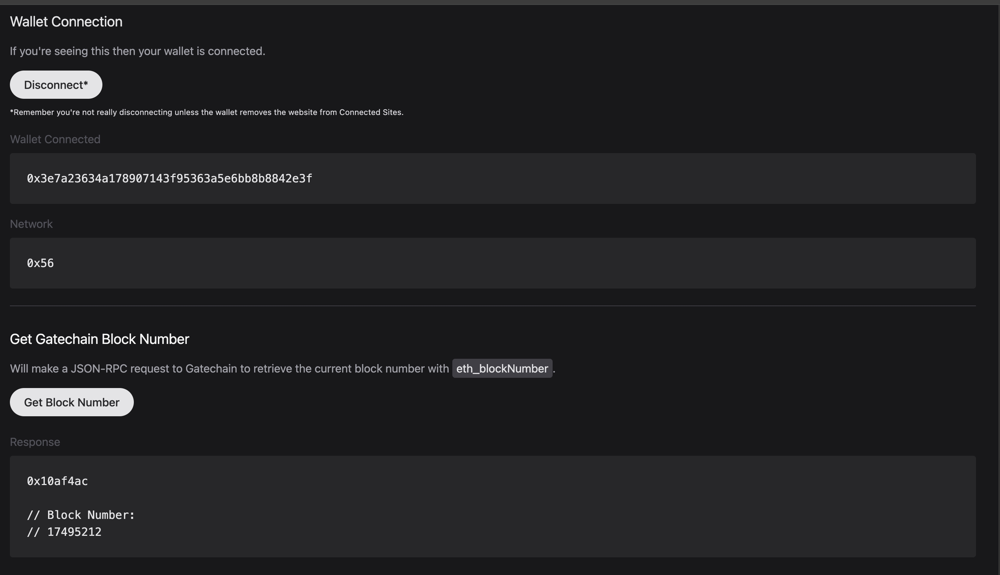

# 构建前端

为确保你能连接到 Gatechain 区块链，请确保你的浏览器钱包已配置好连接到 Gatechain。

本教程将向你展示如何构建一个前端应用，该应用允许钱包连接，并通过 JSON-RPC 端点向 Gatechain 发起 RPC 请求以获取当前区块号。

本项目的目标是使用原生 JavaScript 与 Gatechain 交互，并理解 JSON-RPC 请求的基础知识。

## 要求

在开始之前，请确保你的电脑上已安装以下内容：

- VSCode IDE（推荐）
- NVM 或 Node（v22 或更高版本）
- pnpm、yarn 或 npm

## 代码设置

让我们首先创建项目文件夹。

```bash
mkdir frontend-Gatechain;
cd frontend-Gatechain;
```

从这里开始，我们将安装一些依赖项，这些依赖项将允许我们运行 HTTP 服务器来在网页中查看我们的 HTML 和 JS。

```bash
# FROM: ./frontend-Gatechain;

pnpm init;

# [Expected Output]:
# {
#   "name": "frontend-Gatechain",
#   "version": "1.0.0",
#   "description": "",
#   "main": "index.js",
#   "scripts": {
#     "test": "echo \"Error: no test specified\" && exit 1"
#   },
#   "keywords": [],
#   "author": "",
#   "license": "ISC"
# }
```

安装依赖项，这将允许我们实时重载页面并创建 http 服务器：

```bash
# FROM: ./frontend-Gatechain;

pnpm add -D live-server;
```

接下来，我们将创建一个名为 app 的新文件夹，并在其中创建 index.html 和 scripts.js 文件：

```bash
# FROM: ./frontend-Gatechain;

mkdir app;
touch app/index.html;
touch app/scripts.js;
echo "node_modules" > .gitignore;
git init;
```

让我们先修改 index.html 来显示一些内容：

```html
<!DOCTYPE html>
<html lang="en">
  <head>
    <meta charset="UTF-8" />
    <meta name="viewport" content="width=device-width, initial-scale=1.0" />
    <title>Gatechain Frontend</title>
  </head>
  <body>
    <h1>Gatechain Frontend</h1>
  </body>
</html>
```

现在让我们通过在 package.json 中添加运行命令来查看这些更改：

```json
{
  "name": "frontend-Gatechain",
  "version": "1.0.0",
  "description": "",
  "main": "index.js",
  "scripts": {
    "dev": "./node_modules/.bin/live-server --port=3001 --watch=app --mount=/:./app",
    "test": "echo \"Error: no test specified\" && exit 1"
  },
  "keywords": [],
  "author": "",
  "license": "ISC",
  "devDependencies": {
    "live-server": "^1.2.2"
  }
}
```

通过运行以下命令启动我们的服务器：

```bash
# FROM: ./frontend-Gatechain;

pnpm dev;

# [Expected Output]:
# Mapping / to "/path/to/frontend-Gatechain/app"
# Serving "/path/to/frontend-Gatechain" at http://127.0.0.1:3001
# Ready for changes
```



## 创建我们的 UI

为了使我们的 UI 更容易制作，我们将通过 CDN 使用 Tailwind 来采用其 HTML 元素的类。

为此，我们将修改 index.html 文件，添加 Tailwind 的 CDN 脚本标签和我们的 scripts.js 文件。

注意：这是可选的，但可以让整体页面看起来更好一些。

```html
<!DOCTYPE html>
<html lang="en">
  <head>
    <meta charset="UTF-8" />
    <meta name="viewport" content="width=device-width, initial-scale=1.0" />
    <script src="https://cdn.tailwindcss.com"></script>
    <script src="scripts.js"></script>
    <title>Gatechain Frontend</title>
  </head>
  <body class="bg-zinc-900 pt-24 lg:pt-0">
    <main class="p-8">
      <h1 class="text-2xl text-white mb-4">Gatechain Frontend</h1>

      <p class="text-zinc-400 mb-4">Must use MetaMask for wallet connection.</p>

      <!-- START: Main interaction to connect our wallet -->
      <div class="mb-6">
        <button
          type="button"
          disabled
          id="button-connect"
          class="h-10 bg-zinc-200 text-zinc-800 px-5 rounded-full font-medium disabled:bg-opacity-30"
        >
          Connect Wallet (Unsupported)
        </button>
        <div
          id="div-error-connect"
          class="mt-4 bg-red-300 rounded p-6 text-red-800 hidden"
        ></div>
      </div>
      <!-- END -->

      <hr class="border-zinc-700 mb-8" />

      <!-- START: Main section that will appear when our wallet is connected -->
      <section id="section-connected" class="hidden">
        <h2 id="wallet-connection" class="text-xl text-zinc-200 mb-4">
          Wallet Connection
        </h2>

        <p class="text-zinc-400 mb-4">
          If you're seeing this then your wallet is connected.
        </p>

        <div class="mb-4">
          <button
            type="button"
            id="button-disconnect"
            class="h-10 mb-2 bg-zinc-200 text-zinc-800 px-5 rounded-full font-medium disabled:bg-opacity-30"
          >
            Disconnect*
          </button>
          <p class="text-sm text-zinc-300">
            <small
              >*Remember you're not really disconnecting unless the wallet
              removes the website from Connected Sites.</small
            >
          </p>
        </div>
        <div class="mb-4">
          <label class="block mb-2 text-zinc-600">Wallet Connected</label>
          <code class="block bg-zinc-500 p-6 rounded bg-zinc-800 text-zinc-200">
            <pre id="pre-wallet-address"></pre>
          </code>
        </div>
        <div class="mb-6">
          <label class="block mb-2 text-zinc-600">Network</label>
          <code class="block bg-zinc-500 p-6 rounded bg-zinc-800 text-zinc-200">
            <pre id="pre-wallet-network"></pre>
          </code>
        </div>

        <hr class="border-zinc-700 mb-8" />

        <h2 id="eth-blocknumber" class="text-xl text-zinc-100 mb-4">
          Get Gatechain Block Number
        </h2>

        <p class="text-zinc-400 mb-4">
          Will make a JSON-RPC request to Gatechain to retrieve the current
          block number with
          <span class="bg-zinc-700 text-zinc-200 py-1 px-1.5 rounded"
            >eth_blockNumber</span
          >.
        </p>

        <form id="form-eth-blocknumber">
          <div class="mb-4">
            <button
              type="submit"
              class="h-10 mb-2 bg-zinc-200 text-zinc-800 px-5 rounded-full font-medium disabled:bg-opacity-30"
            >
              Get Block Number
            </button>
          </div>

          <!-- Where the results are displayed -->
          <div class="mb-4">
            <label class="block mb-2 text-zinc-600">Response</label>
            <code
              class="block bg-zinc-500 p-6 rounded bg-zinc-800 text-zinc-200"
            >
              <pre id="pre-eth-blocknumber"></pre>
            </code>
          </div>
        </form>
      </section>
      <!-- END -->
    </main>
  </body>
</html>
```



## JavaScript 功能

现在我们已经设置好了 HTML 结构，让我们添加允许我们将钱包连接到浏览器的功能。

这将包含相当多的代码，但请查看注释以更好地了解所有功能。

```javascript
// Main Function
// ========================================================
/**
 * Main wallet connection interaction
 */
const connect = async () => {
  console.group("connect");

  // Hide errors when trying to connect
  const devErrorConnect = document.getElementById("div-error-connect");
  devErrorConnect.innerHTML = "";
  devErrorConnect.classList = devErrorConnect.classList.value.includes("hidden")
    ? devErrorConnect.classList.value
    : `${devErrorConnect.classList.value} hidden`;

  // Attempt to connect to wallet with JSON-RPC request
  try {
    const accounts = await window.ethereum.request({
      method: "eth_requestAccounts",
    });
    const chainId = await ethereum.request({ method: "eth_chainId" });

    // Disable connect button
    const buttonConnect = document.getElementById("button-connect");
    buttonConnect.setAttribute("disabled", true);
    buttonConnect.innerHTML = "Connected";

    // Show connected section
    const sectionConnected = document.getElementById("section-connected");
    sectionConnected.classList = "";

    // Display wallet connected
    const preWalletAddress = document.getElementById("pre-wallet-address");
    preWalletAddress.innerHTML = accounts[0];

    // Display current network connected
    const preWalletNetwork = document.getElementById("pre-wallet-network");
    preWalletNetwork.innerHTML = `${chainId}`;
  } catch (error) {
    console.log({ error });
    devErrorConnect.innerHTML =
      error?.message ?? "Unknown wallet connection error.";
    devErrorConnect.classList = devErrorConnect.classList.value.replaceAll(
      "hidden",
      ""
    );
  }
  console.groupEnd();
};

/**
 * Main function that disconnects from the browser
 */
const disconnect = () => {
  console.group("disconnect");

  // Hide connected section
  const sectionConnected = document.getElementById("section-connected");
  sectionConnected.classList = "hidden";

  // Enabled connect button
  const buttonConnect = document.getElementById("button-connect");
  buttonConnect.removeAttribute("disabled");
  buttonConnect.innerHTML = "Connect Wallet";

  console.groupEnd();
};

/**
 * Main function that handles the form request for a read JSON-RPC request
 * @param {*} event
 */
const onSubmitEthBlockNumber = async (event) => {
  event.preventDefault();
  console.group("onSubmitEthBlockNumber");

  // Reset & Set Loading State
  const preEthBlockNumber = document.getElementById("pre-eth-blocknumber");
  const button = document.querySelector(`#${event.currentTarget.id} button`);
  button.setAttribute("disabled", true);
  button.innerHTML = `${button.innerHTML} (Loading...)`;

  // Attempt request for block number
  try {
    const result = await window.ethereum.request({
      method: "eth_blockNumber",
    });

    console.log({ result });

    preEthBlockNumber.innerHTML = `${result}\n\n// Block Number:\n// ${parseInt(
      result,
      16
    )}`;
  } catch (error) {
    console.log({ error });
    preEthBlockNumber.innerHTML = error?.message ?? "Unknown JSON-RPC error.";
  }

  button.removeAttribute("disabled");
  button.innerHTML = "Get Block Number";
};

// Initial Script Loaded On Window Loaded
// ========================================================
/**
 * Init
 */
window.onload = async () => {
  console.log("WINDOW ONLOAD!");

  // Get All Elements
  const buttonConnect = document.getElementById("button-connect");
  const buttonDisconnect = document.getElementById("button-disconnect");
  const formEthBlockNumber = document.getElementById("form-eth-blocknumber");

  // Add Interactions
  buttonConnect.addEventListener("click", connect);
  buttonDisconnect.addEventListener("click", disconnect);
  formEthBlockNumber.addEventListener("submit", onSubmitEthBlockNumber);

  // Check if browser has wallet integration
  if (typeof window?.ethereum !== "undefined") {
    // Activate elements
    buttonConnect.removeAttribute("disabled");
    buttonConnect.innerHTML = "Connect Wallet";
  }
};
```

现在，如果我们使用已设置 MetaMask 的浏览器进行连接，我们可以看到以下交互。

注意：请确保你的钱包已设置为 Gatechain 网络。

我们可以连接到网站并查看我们当前的钱包地址和当前链 ID。



如果我们提交表单并执行 RPC 请求，我们可以看到显示的结果。



## 下一步

有很多库和框架可以帮助加速构建 dApps，包括 React、NextJS、Svelte、Wagmi、Ethers、Viem、WalletConnect 和 RainbowKit 等。更多详情请参见开发者工具。

现在你已经了解了如何通过前端与 Gatechain 交互，请浏览一些开发者指南，开始构建智能合约或构建其他前端应用程序。

## 页面导航
[上一页 - 构建智能合约]()
