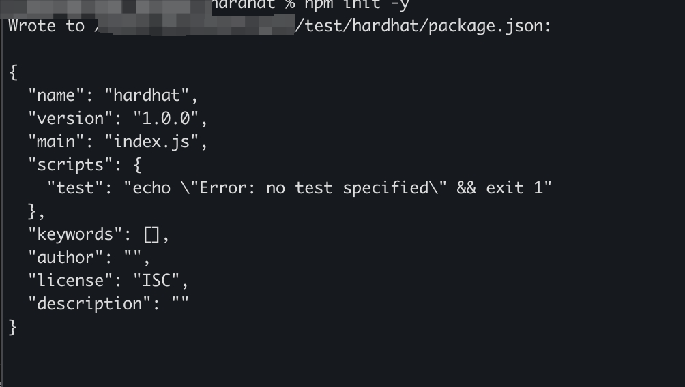
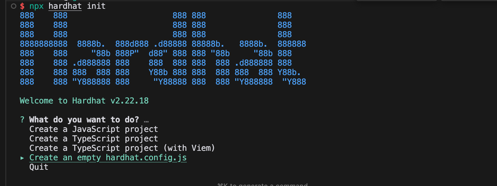
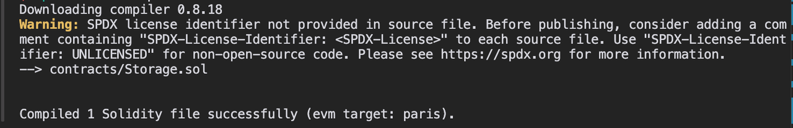
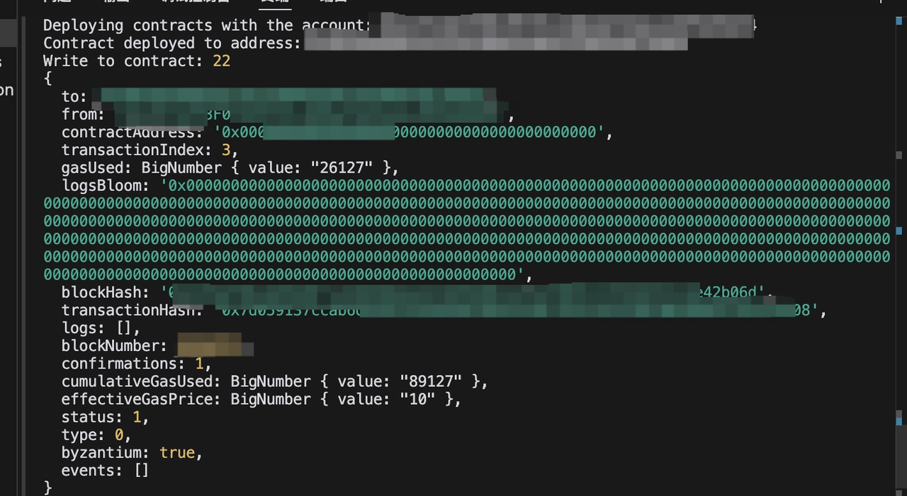

# 使用 Hardhat 在 GateChain 主网上部署智能合约

本指南提供了一个使用 Hardhat（一个流行的以太坊开发环境）在 GateChain 主网上部署智能合约的分步教程。您将学习如何设置 Hardhat 项目、为 GateChain 配置它、编写一个简单的智能合约，并将其部署到 GateChain 主网。本教程非常适合熟悉以太坊开发并想要开始在 GateChain 上构建的开发者。

## 1. 创建 Hardhat 项目

### 1.1 创建项目目录
```bash
mkdir hardhat && cd hardhat
```

### 1.2 初始化项目（创建 package.json）
```bash
npm init -y
```



### 1.3 安装 Hardhat
```bash
npm install hardhat
```

### 1.4 创建 Hardhat 项目
```bash
npx hardhat init
```


### 1.5 选择项目类型
选择 `Create an empty hardhat.config.js` 选项，这将为您的项目创建一个基本的 Hardhat 配置文件。

## 2. 修改 Hardhat 配置文件

### 2.1 配置 hardhat.config.js

主要配置内容：
- Solidity 编译器版本：0.8.18
- GateChain 主网 EVM RPC 地址选项：
  - https://evm.nodeinfo.cc（推荐）
  - https://evm-1.nodeinfo.cc
  - https://evm.gatenode.cc
  - https://evm-hk.gatenode.cc（香港节点）
- chainId：86（GateChain 主网链 ID）

```javascript
require("@nomicfoundation/hardhat-toolbox");
require("@nomiclabs/hardhat-web3");

/** @type import('hardhat/config').HardhatUserConfig */

const privateKey = 'INSERT_PRIVATE_KEY';

module.exports = {
  solidity: '0.8.18',
  networks: {
    Mainnet: {
      url: 'https://evm.nodeinfo.cc', 
      chainId: 86, 
      accounts: [privateKey],
      gasPrice: 10000000000, // 10 gwei
    },
  },
};
```

## 3. 编写合约文件

### 3.1 创建 Contracts 目录
```bash
mkdir contracts
```

### 3.2 创建合约文件
```bash
touch contracts/Storage.sol
```

### 3.3 合约内容
```solidity
pragma solidity ^0.8.0;

contract Storage {
    uint storedData;

    function set(uint x) public {
        storedData = x;
    }

    function get() public view returns (uint) {
        return storedData;
    }
}
```

## 4. 编译 Solidity

### 4.1 安装依赖
```bash
npm install @nomicfoundation/hardhat-toolbox@^2.0.2 @nomiclabs/hardhat-web3@^2.0.0
```

### 4.2 编译合约
```bash
npx hardhat compile
```



编译后，项目中将创建一个 `artifacts` 目录，其中包含合约字节码和元数据（.json 文件）。建议将此目录添加到 .gitignore 中。

## 5. 部署合约

### 5.1 创建部署脚本
```bash
mkdir scripts && touch scripts/deploy.js
```

### 5.2 部署脚本内容
```javascript
const { ethers } = require("hardhat");
async function deploy(deployer) {
    const Contract = await ethers.getContractFactory("Storage", deployer);
    const contract = await Contract.deploy();
    await contract.deployed();
    console.log("Contract deployed to address:", contract.address);
    return contract.address;
}

async function call(contractAddress, deployer) {
    const Contract = await ethers.getContractFactory("Storage",deployer);
    const contract = await Contract.attach(contractAddress);
    const number = 22;
    console.log("Write to contract:", number);
    const tx = await contract.set(number);

    receipt = await tx.wait();
    console.log(receipt);

    const counter = await contract.get();
    console.log("Read from contract:", counter);
}

async function main(){
    const [deployer] = await ethers.getSigners();
    console.log(
        "Deploying contracts with the account:",
        deployer.address
    );

    const address = await deploy(deployer);
    await call(address,deployer);
}

main() .then(() => process.exit(0))
    .catch(error => {
        console.error(error);
        process.exit(1);
    });
```

### 5.3 运行部署脚本
```bash
npx hardhat run scripts/deploy.js --network Mainnet
```


## 6. 查询交易

部署后，您可以在 GateChain 区块浏览器上查看合约交互详情。

重要提示：
- 确保将配置文件中的 `privateKey` 替换为您自己的私钥
- 部署前确保您的账户中有足够的 GT 支付 gas 费用
- 建议在部署到主网之前在测试网上进行测试 