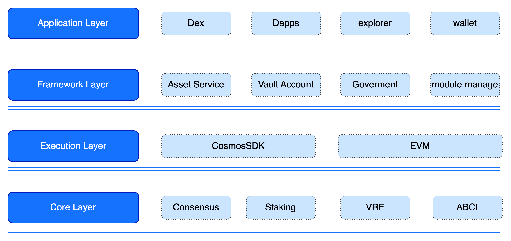

# GateChain 区块链

最初，GateChain 的主网是基于 UTXO 架构构建的，实现了自己的安全账户模型并进行了原型验证。这项工作在业界得到认可，并形成了一篇题为"基于 UTXO 模型的安全账户研究"的研究论文（待发表）。随后，为了更好地与跨链生态系统集成，GateChain 的架构迁移到了由 Tendermint 基础设施支持的区块链框架。

在共识层面，它借鉴了 Algorand 的共识机制，利用 VRF（可验证随机函数）算法来提高安全性和效率。新架构直接采用账户模型，专注于上层协议创新，特别强调实现具有可撤销交易和清算能力的独特安全账户。

在应用层，新架构提供标准接口以满足各种上层应用的需求，并提供基于 SDK 的离线账户生成和交易签名功能，为第三方生态系统应用提供便捷的开发工具。

## 层级详情

### 应用层
最顶层包含面向用户的应用：
- **Dex**：用于代币交换和交易的去中心化交易所
- **Dapps**：去中心化应用生态系统
- **Explorer**：用于查询交易和区块的区块链浏览器
- **Wallet**：用于管理用户资产的数字资产钱包

### 框架层
提供核心区块链服务和功能框架：
- **Asset Service**：处理代币和资产管理
- **Vault Account**：数字资产安全存储系统
- **Goverment**：用于决策的链上治理系统
- **Module Manage**：协调各种功能模块

### 执行层
负责智能合约和交易执行环境：
- **CosmosSDK**：基于 Cosmos 的开发工具包，提供区块链基础设施
- **EVM**：用于执行以太坊兼容智能合约的以太坊虚拟机

### 核心层
构成基础设施和核心功能：
- **Consensus**：确保网络节点达成一致
- **Staking**：用于网络安全和验证者选择的机制
- **VRF**：用于安全随机性的可验证随机函数
- **ABCI**：连接区块链应用与共识引擎的应用区块链接口

