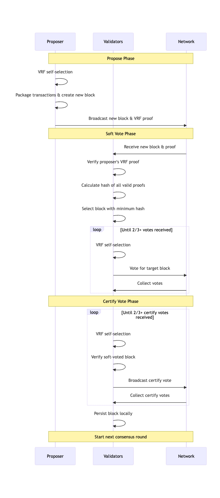

# GateChain 共识机制

基于基础 PoS 机制，GateChain 进行了进一步优化，使用户更容易参与网络共识、实现资产增值和去中心化管理。与大多数 PoS 经济模型不同，GateChain 注重资产收益的包容性，允许更多用户轻松参与共识，同时保护 GateChain 的安全稳定运行并获得合理回报。

## 关键术语

### GateToken (GT)
GateChain 主网的原生代币，用于一般价值交换、交易费用支付和确定共识权重。

### 共识账户 (Con-account)
具有非零 GT 余额的普通账户，通过发起"共识账户上线"交易并支付费用（与当时普通转账手续费费用相同）成为共识账户。共识账户有资格参与每轮共识，参与程度取决于持有的 GT 数量。共识开始后，共识账户进行"自抽签"，如果被选中，则进入"委员会"进行区块提议和验证。

### 共识权重 (Power)
共识账户持有的 GT 的加权计算决定其共识权重。此权重作为自抽签算法的输入参数，决定账户长期被选入委员会的概率。

### 自抽签 VRF选择
通过VRF算法(Verifiable Random Function)进行随机概率计算，中签的概率取决于GT的加权数量之和、全网GT的数量总和。长期的概率分布符合共识账户持有GT占全网的比例。

### 委员会
“自抽签”中签的共识账户，会进入此轮共识的委员会。委员会负责本轮共识的提议、验证、投票。进入委员会的共识账户，有概率获得本轮的区块奖励和交易手续费

### 委员会领导者
在每轮共识中，从委员会中以相等概率选出最多三个共识账户成为领导者。领导者获得该轮的区块奖励。

### 忠诚度参数

每个共识账户都有一个忠诚度系数，初始值为 1。随着参与共识次数的增加，忠诚度系数逐渐增加，最大值为 2。忠诚度系数作为用户权重的"乘数"，使持续参与共识的账户获得额外的投票权和奖励。
如果共识账户进行恶意投票、长期不参与共识（根据权重计算）或主动降低其权重，忠诚度系数将会降低。

## Gatemint 共识流程

### 1. 提议阶段
1. 所有共识账户（con-accounts）开始 VRF 选择
2. 被选中的账户从交易池组织交易并打包成新区块
3. 将新区块和 VRF 证明广播给所有节点

### 2. 软投票阶段
1. 每个节点接收 n 个新提议的区块 + 证明
2. 首先验证提议节点是否真实被选中（使用 VRF 算法验证提议节点的公钥和证明）
3. 验证后，计算所有已验证证明的哈希，结果最小的成为本轮目标区块
4. 所有账户进行自选，被选中的账户对计算出的区块进行投票并广播投票信息
5. 所有节点收集投票信息，当票数超过 2/3 时本轮结束，进入下一步

### 3. 认证投票阶段
1. 每个账户进行自选
2. 被选中的账户开始验证软投票选出的区块是否存在双花等问题
3. 验证后进行投票并广播
4. 所有节点收集本轮投票，超过 2/3 时将区块持久化到本地存储
5. 当前区块共识结束，开始下一轮

