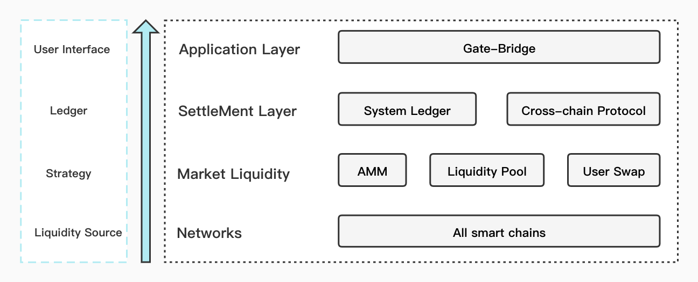
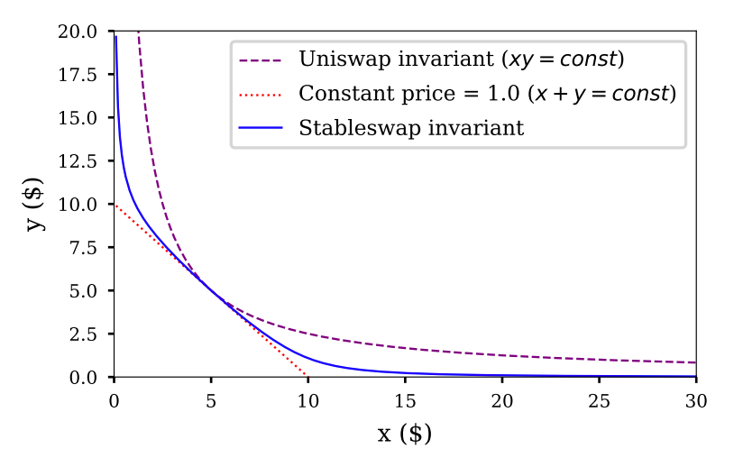
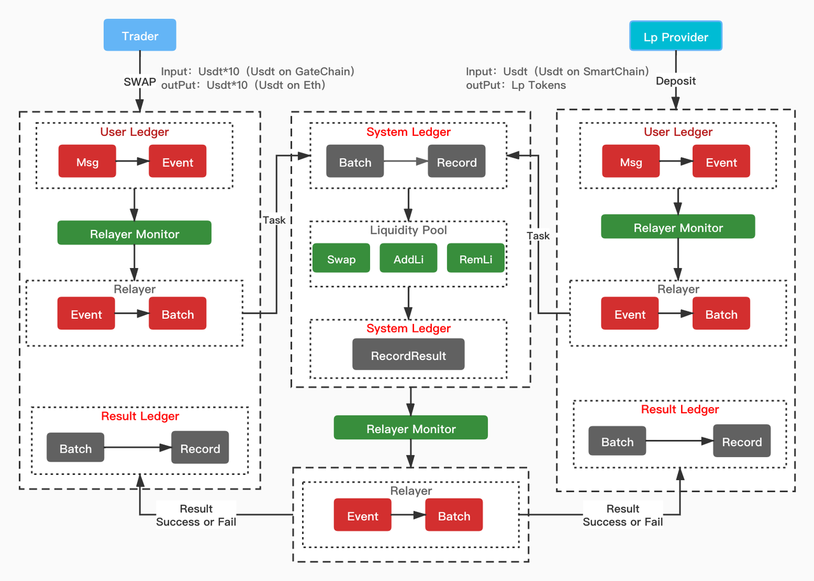
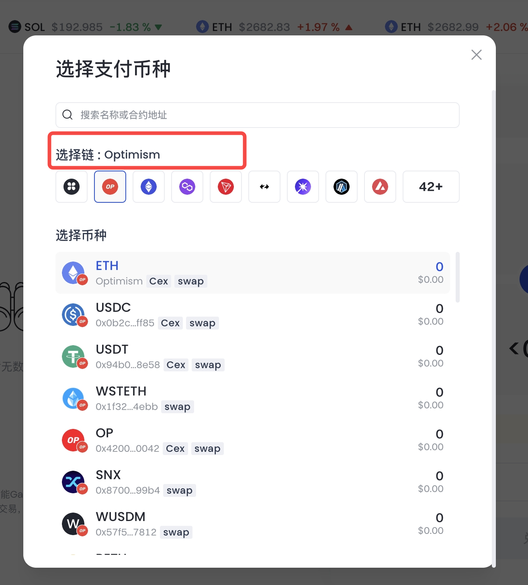
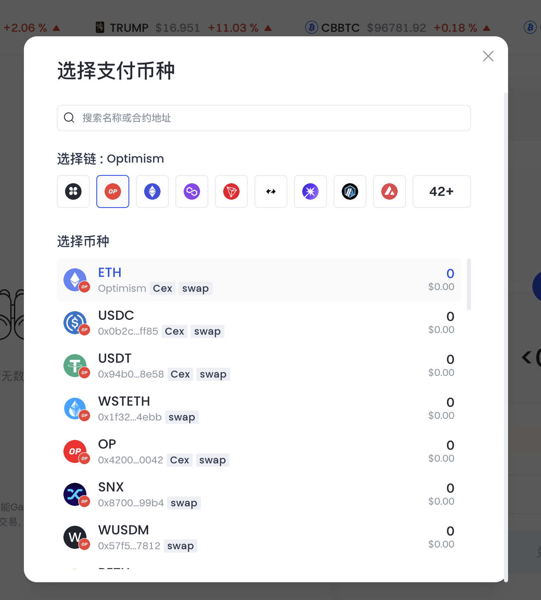

## 功能介绍

GateBridge 提供基于流动性池的跨链协议，以更广泛的意义重新定义了流动性池的概念，采用全新的做市模型和独特的订单簿模式。

## 功能模块

GateBridge 设计了四层跨链结构：

   1. 网络：GateBridge 支持市场上几乎所有基于 EVM 的智能链，确保所有支持链之间的快速和安全资产转移。
   2. 市场流动性：GateBridge 广义地定义了流动性池，在跨链转账或交换中引入跨链自动做市商角色。
   3. 结算：交易通过智能合约结算，使用私钥进行授权和签名，基于三层账本模型实现安全、快速和低成本的跨链转账和结算。
   4. 应用：GateBridge 提供易用且直观的界面，以提供更好的用户体验。

## 核心模块

### 系统角色

1. 用户：使用 GateBridge 进行跨链资产转移的人。
2. 中继器：由多个节点组成，负责在链间传递数据。
3. 流动性池：部署在每个智能链上的一系列智能合约，负责链间资产交换。
4. 账本：部署在每个智能链上的一系列智能合约，负责维护整个系统的账本和安全性。
5. 流动性提供者：
   1. 来自不同链和代币的 AMM；
   2. 为跨链流动性池提供流动性的 LP。

### 账本模型

1. 用户交易账本：记录用户与流动性池相关操作的账本。用户账本通过部署在智能链上的智能合约实现。
2. 系统账本：整个跨链系统的账本，是部署在 GateChain 主网上的智能合约，以最小的维护成本确保安全性。
3. 结果账本：系统账本上的交易执行结果将发送到每个智能链并执行，结果将记录在部署在每个智能链上的 LP 账本中。

### 定价模型

在跨链转账中，交换的资产通常是相同的代币，因此固定的 1:1 价格更符合这个定义。假设有两种资产：X 和 Y，出售 dx 的 X 将获得 dy 的 Y，此时 $dx = dy$。这可以描述为任意数量资产 X 的线性不变量，即恒定和模型：

$$\sum x_i=D$$

此模型中的资产价格可以确定为 $dx_i/dx_j$；假设 $dx_i = dx_j$，价格将始终为 1，这意味着池中所有代币价格相同。然而，这个模型不太适合资产应该自动调整的交易市场，对中的一种资产储备很容易耗尽，导致跨链转账失败。许多知名的去中心化交易所，如 Uniswap 或 Balancer，使用恒定乘积模型来允许价格根据市场条件波动。公式如下：

$$x * y=D$$

该公式可以扩展到具有任何分配和数量代币的流动性池；例如 Balancer 使用的模型：

$$\prod x_i^{w_i}=D$$

但当模型用于稳定价格的代币时，会产生巨大的滑点。因此，我们研究了 stableswap 或混合恒定和与恒定乘积的定价模型，当两个代币达到平衡时类似于恒定和曲线，当平衡被打破时类似于恒定乘积曲线。这个模型中的滑点看起来像一个平底锅，在平底部分几乎没有滑点，而在平坦区域之外的数据会有较大滑点。见下图：

StableSwap 模型的公式：

$$An^n\sum x_i + D = ADn^n + \frac{D^{n+1}}{n^n\prod x_i}$$

对于资产组合 $\{x_i\}$，我们得到一个 $D$；当池中的资产交换时，等号左右两边应该相等；这就是 StableSwap 计算价格的方式。在这个模型中，当资产分配不平衡时，会创造套利机会，很快会被套利者利用，从而使资产分配恢复平衡。然而，这种模式也有其缺点：

1. 对于小值池，添加或移除流动性很容易在平底区域之外产生过度滑点，导致显著的滑点损失。
2. 对于在某些链上具有不平衡流行度的资产，池中的资产数量格式可能分配不公平，从而导致池中价格严重偏离。

为解决这些问题，我们改进了 Stableswap 模型：

1. 当池中资产价值低于阈值时，使用恒定和模型；只有在达到预设阈值时才使用混合恒定和与恒定乘积模型。
2. 当池中资产分配严重不平衡时，价格受上下限限制，以确保流动性提供者的可管理滑点。当套利者后来加入恢复平衡时，价格将恢复。
3. 当向一侧添加流动性，这会在平底区域之外增大滑点时，将收取额外费用以抵消池中 LP 的滑点损失。

### 跨链转账流程

#### 添加流动性示例：

1. 流动性提供者 Alice 想在以太坊上向池中添加 100 BTC。在 GateBridge 界面上，Alice 选择添加流动性，然后存入 100 BTC。用户账本将添加一条记录，表明 Alice 在流动性池中添加了 100 BTC。
2. 每个中继器监控到 Alice 向流动性池添加了 100 BTC，它会打包此消息和其他用户事件，发送到 GateChain 的系统账本。
3. 系统账本将接收来自中继器的包，然后验证该包是否得到一定数量中继器的批准（POA）；如果是，则包中的交易将发送到相关流动性池进行计算，在本例中是 BTC 池。
4. 当流动性池完成计算后，结果将记录在系统账本上。
5. 中继器检测到系统账本上的执行结果，它们会打包计算结果并发送到特定链执行。在本例中是以太坊。
6. 以太坊上的结果账本收到中继器的结果后，会检查执行结果，如果成功，则向 Alice 发送价值 100 BTC 的 LP 代币；否则将 100 BTC 退回给 Alice。
7. 移除流动性的过程也很相似。

#### 用户跨链示例：

1. Bob 想从以太坊向 BSC 发送 10 BTC，所以 Bob 在 GateBridge 界面上选择跨链交换，并输入 10 BTC。操作成功完成后，用户账本上会记录一条从以太坊向 BSC 发送 10 BTC 的记录。
2. 中继器监控 Bob 的操作，所有中继器会将此操作和其他用户事件打包，发送到 GateChain 的系统账本。
3. 在收到不同中继器的交易包后，系统账本验证该包是否得到一定数量中继器的批准；如果是，则交易将发送到流动性池进行计算，在本例中是 BTC 流动性池。
4. 流动性池完成计算后，结果将记录在系统账本上。
5. 当中继器监控到系统账本的结果时，它们会打包结果并发送到目标链执行：如果结果成功，则计算结果将打包并发送到 BSC；如果失败（失败的主要原因是 BSC 上流动性不足，导致无法提取 10 BTC），计算结果将发送回以太坊。
6. 如果 BSC 上的结果账本收到中继器的结果，则执行成功；将扣除流动性费用后的 10 BTC 发送给 Bob；如果以太坊的结果账本收到结果，则执行失败，10 BTC 将退回给 Bob。

## 连接到 GateChain

  1. 访问 [GateBridge](https://www.gate.io/zh/web3/swap/gt-bnb?input_chain=86&input_token=GT&output_chain=56&output_token=BNB)
  

  2. 选择源链 - 指示您的资产当前所在的区块链。

  3. 选择您的资产：决定您希望桥接到 GateChain 的资产。这里包含了一个较小的、流动性更强的资产子集，如稳定币。始终验证您要桥接的代币是否正确。
  

  	  	