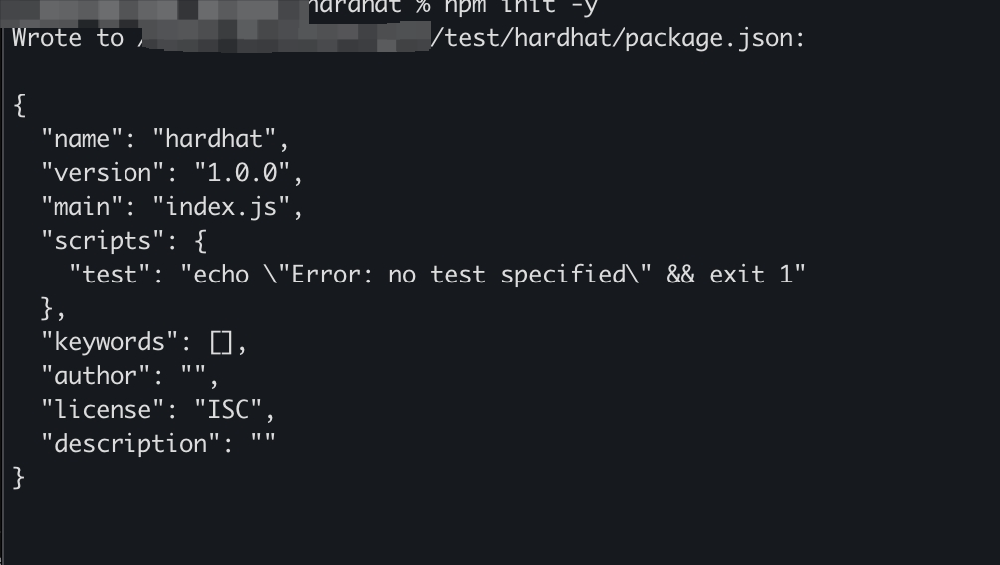
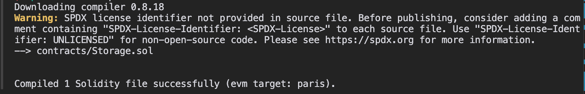
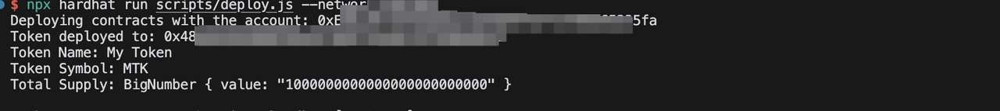
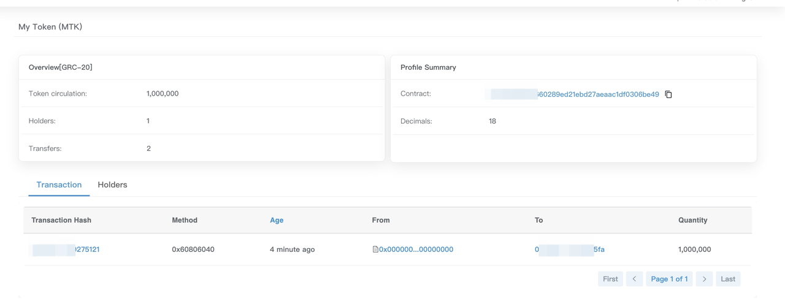

# 使用 Hardhat 创建和部署 ERC20 代币

本指南演示如何使用 Hardhat 创建 ERC20 合约并将其部署到 GateChain 主网。

## 1. 创建 Hardhat 项目

### 1.1 创建项目目录
```bash
mkdir hardhat && cd hardhat
```

### 1.2 初始化项目
初始化项目以创建 package.json 文件：
```bash
npm init -y
```

### 1.3 安装 Hardhat
```bash
npm install hardhat
```

### 1.4 创建 Hardhat 项目
```bash
npx hardhat init
```

### 1.5 选择项目类型
系统将显示一个菜单，允许您创建新项目或使用模板项目。在本例中，选择 `Create an empty hardhat.config.js`，这将为您的项目创建一个 Hardhat 配置文件。

## 2. 修改 Hardhat 配置文件

### 2.1 修改 hardhat.config.js

配置详情：
- Solidity 编译器版本：0.8.18
- GateChain 主网 EVM RPC URLs：
  - https://evm.nodeinfo.cc（推荐）
  - https://evm-1.nodeinfo.cc
  - https://evm.gatenode.cc
  - https://evm-hk.gatenode.cc（香港节点）
- chainId：GateChain 主网链 ID 86
- privateKey：用于部署和与智能合约交互的账户。请替换为您的私钥

```javascript
require("@nomicfoundation/hardhat-toolbox");
require("@nomiclabs/hardhat-web3");

/** @type import('hardhat/config').HardhatUserConfig */

const privateKey = 'INSERT_PRIVATE_KEY';

module.exports = {
  solidity: '0.8.20',
  networks: {
    Mainnet: {
      url: 'https://evm.nodeinfo.cc', 
      chainId: 86, 
      accounts: [privateKey],
      gasPrice: 10000000000, // 10 gwei
    },
  },
};
```

## 3. 编写合约文件

### 3.1 创建 contracts 目录
```bash
mkdir contracts
```

### 3.2 创建 MyToken.sol 文件
```bash
touch contracts/MyToken.sol
```

### 3.3 添加合约内容
```solidity
// SPDX-License-Identifier: MIT
pragma solidity ^0.8.20;

import "@openzeppelin/contracts/token/ERC20/ERC20.sol";
import "@openzeppelin/contracts/access/Ownable.sol";

contract MyToken is ERC20, Ownable {
    constructor(string memory name, string memory symbol, uint256 initialSupply) 
        ERC20(name, symbol)
        Ownable(msg.sender)
    {
        _mint(msg.sender, initialSupply * 10 ** decimals());
    }

    function mint(address to, uint256 amount) public onlyOwner {
        _mint(to, amount);
    }
}
```

## 4. 编译 Solidity

### 4.1 安装依赖
```bash
npm install @nomicfoundation/hardhat-toolbox@^2.0.2 @nomiclabs/hardhat-web3@^2.0.0 @openzeppelin/contracts
```

### 4.2 编译合约
您可以使用 Hardhat 的内置编译任务。此任务将在 contracts 目录中查找 Solidity 文件，并根据 hardhat.config.js 中定义的版本和设置进行编译。

运行以下命令编译合约：
```bash
npx hardhat compile
```


编译后，将创建一个 artifacts 目录：其中包含 .json 文件中的合约字节码和元数据。您可以将此目录添加到 .gitignore 中。

如果在编译后修改了合约内容，您可以使用上述命令重新编译合约。Hardhat 将自动检测更改并重新编译合约。如果没有更新，则不会进行编译。如果需要，您可以使用 clean 任务强制重新编译，这将清理缓存文件并删除旧的构件文件。

## 5. 部署合约

### 5.1 创建部署脚本
```bash
mkdir scripts && touch scripts/deploy.js
```

### 5.2 编写部署脚本
```javascript
const hre = require("hardhat");

async function main() {
  const [deployer] = await ethers.getSigners();
  console.log("Deploying contracts with the account:", deployer.address);

  const tokenName = "My Token";
  const tokenSymbol = "MTK";
  const initialSupply = 1000000; // 100万代币

  const MyToken = await hre.ethers.getContractFactory("MyToken");
  const myToken = await MyToken.deploy(tokenName, tokenSymbol, initialSupply);

  await myToken.deployed();

  console.log("Token deployed to:", myToken.address);
  console.log("Token Name:", await myToken.name());
  console.log("Token Symbol:", await myToken.symbol());
  console.log("Total Supply:", await myToken.totalSupply());
}

main().catch((error) => {
  console.error(error);
  process.exitCode = 1;
});
```

### 5.3 运行部署脚本
```bash
npx hardhat run scripts/deploy.js --network Mainnet
```



