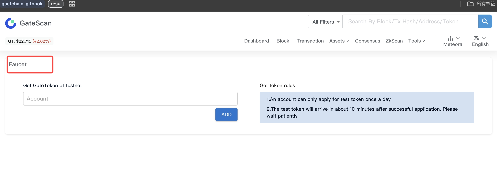

Get Test Tokens Through Website:
To request test tokens, visit the application portal.
Enter the account address where you want to receive test tokens, click "Add Request", and within a few minutes the test tokens will appear in your wallet balance.

Note: Each account can only request test tokens once within 24 hours. When requesting test tokens through the wallet, you will receive the following prompt.

